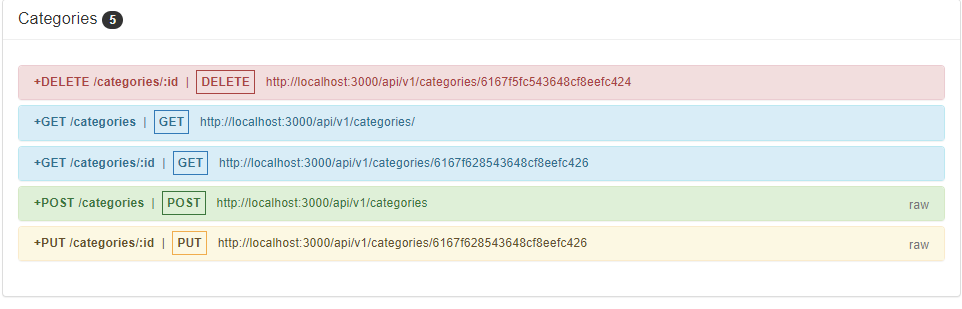
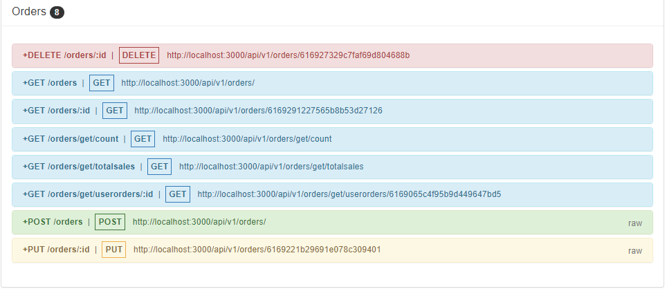
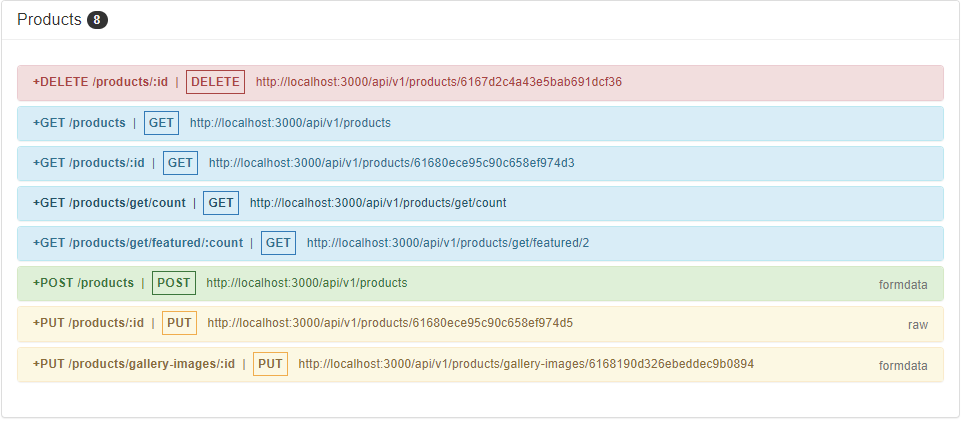
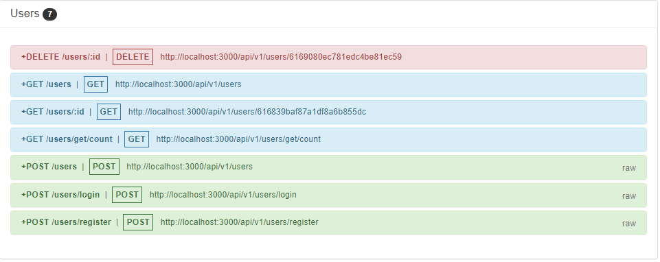

# E-Commerce Backend
Backend for an ecommerce application created in Node.js.

## Features

- CRUD operation on Users, Orders, Order-Item, Category and Product
- Login process is secured using JWT.

## Tech

This application uses a number of open source projects to work properly:

- [Node.js] - Node.js is an open-source, cross-platform, back-end JavaScript runtime environment that runs on the V8 engine and executes JavaScript code outside a web browser.
- [Express] -  Express.js is a back end web application framework for Node.js. It is designed for building web applications and APIs. 
- [JWT] - JSON Web Token is a proposed Internet standard for creating data with optional signature and/or optional encryption whose payload holds JSON that asserts some number of claims.

And of course this application itself is open source with every code available here in github.

## Installation

Requires [Node.js](https://nodejs.org/) v10+ to run.

Install the dependencies and start the server.

```sh
npm install
npm run app.js
```

## Screenshot

##### Categories Route


##### Orders Route


##### Products Route


##### Users Route


## Development

Want to contribute? Great!

This application uses Node.js + Express for fast developing.
Make a change in your file and instantaneously see your updates!

The application requires a few environment variables such as
- [API_URL] - The API base URL
- [CONNECTION_STRING] -  Cloud database URI
- [SECRET] - JWT secret

Open your favorite Terminal and run these commands.

Terminal:

```sh
npm install
npm start
```

## Note

- Need to provide environment variables to run the application.The mandatory environment variables are mentioned in the development section.


<!-- ## License

MIT -->


